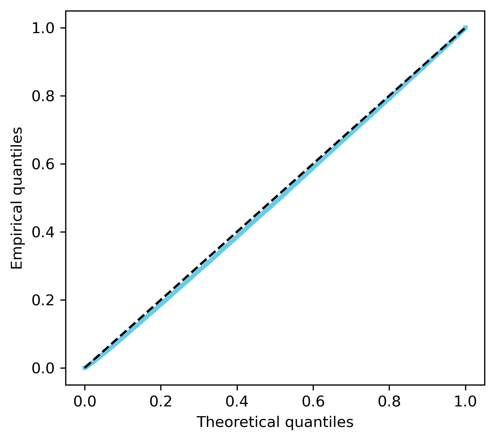
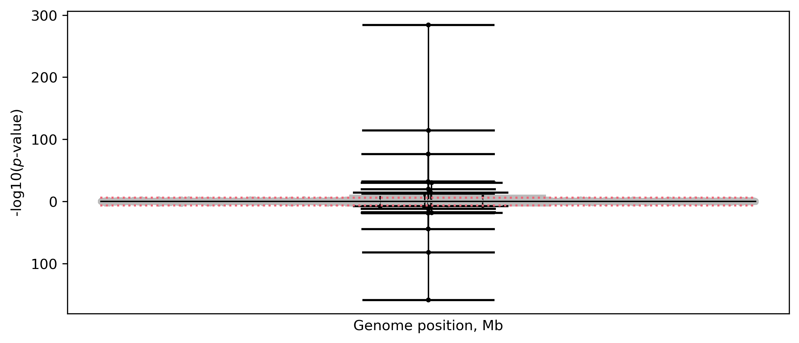
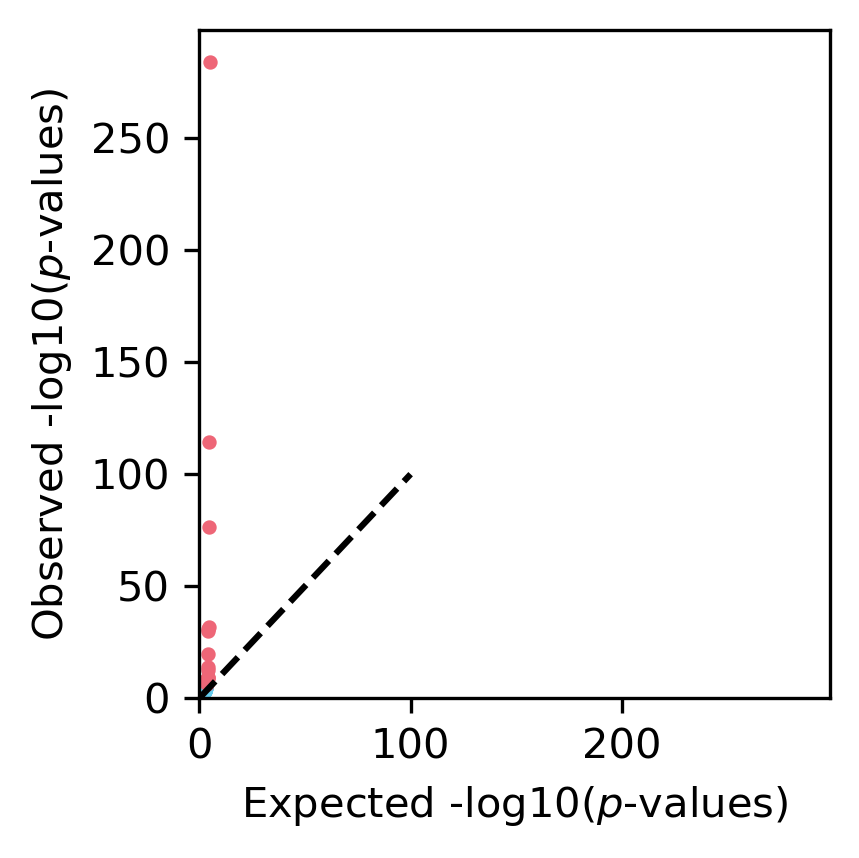

# Recombination Suppression Simulations

This repository contains a simulation pipeline for modeling a mutation that suppresses recombination in a genomic region. The pipeline uses SLiM for forward-time genetic simulation and tree sequence tools (tskit, pyslim, msprime) for post-processing and analysis.

## Overview

The simulation models a scenario where a mutation suppresses recombination in a defined genomic window around it. Carriers of this mutation experience reduced recombination rates within the suppressed region, while non-carriers recombine normally.

## Pipeline

```
simulation.py
     |
     v
SLiM (rec_suppression_script.slim)
     |
     v
recomb_suppressor.trees
     |
     v
Recapitation (rec_suppression_recapitation.py)
     |
     v
recomb_suppressor_recap.trees --> reduced_samples.trees
     |
     v
DoLoReS analysis (Detection of Localised Recombination Suppression)
     |
     v
reduced_samples_output/
```

## Requirements

- SLiM 5
- Python 3.x
- pyslim
- msprime
- tskit
- numpy

For DoLoReS analysis:
```
pip install -r dolores/requirements.txt
```

## Scripts

### simulation.py

Main orchestrator script that runs the SLiM simulation and subsequent recapitation. Execute from the `scripts/` directory:

```bash
cd dolores
python python ../scripts/simulation.py 
```

### rec_suppression_script.slim

The SLiM script that performs the forward-time simulation. It implements:

- Conditional establishment: If the suppressor mutation is lost, the simulation restores from a checkpoint and re-introduces it
- Custom recombination callback: Carriers experience reduced recombination in the suppressed region
- Tree sequence output for downstream analysis

### rec_suppression_recapitation.py

Post-processing script that:
1. Recapitates the tree sequence (adds coalescent history to MRCA)
2. Samples individuals and simplifies for analysis

Usage:
```bash
python rec_suppression_recapitation.py <input.trees> <ancestral_Ne> <recomb_rate> <output.trees>
```

## SLiM Model Parameters

| Parameter | Default | Description |
|-----------|---------|-------------|
| `n` | 1000 | Diploid population size (2000 haploid chromosomes) |
| `n_intro` | 1 | Number of individuals to introduce the suppressor mutation in |
| `l` | 1,000,000 | Chromosome length in base pairs |
| `sup_pos` | 500,000 | Position of the suppressor mutation (center of chromosome) |
| `sup_start` | 400,000 | Start position of the suppressed recombination region |
| `sup_end` | 600,000 | End position of the suppressed recombination region |
| `clade_size` | NULL | Target clade size for early stopping; if NULL, runs for 2N generations |
| `alpha` | 0.9999 | Suppression strength (0.9999 = 99.99% reduction in recombination) |
| `h` | 1.0 | Dominance coefficient of the suppressor mutation |
| `exp_r` | 1e-6 | Baseline recombination rate per bp per generation |
| `outfile` | recomb_suppressor.trees | Output file name for tree sequence |

### Recombination Model

The recombination rate within the suppressed region depends on genotype:

- **Wild-type (0 copies)**: Normal recombination rate
- **Heterozygote (1 copy)**: Rate multiplied by `1 - h * alpha`
- **Homozygote (2 copies)**: Rate multiplied by `1 - alpha`

With default parameters (h=1.0, alpha=0.9999), both heterozygotes and homozygotes experience 99.99% reduction in recombination within the 200 kb suppressed window.

## DoLoReS Analysis Results

DoLoReS (Detection of Localised Recombination Suppression) was used to detect signals of recombination suppression in the simulated data. The analysis was run on a sample of 100 individuals from the simulation.

### Q-Q Plot



The Q-Q plot compares observed p-values from Test 1 against expected p-values under the null hypothesis. Deviation from the diagonal indicates clades with unexpectedly long genomic spans, consistent with recombination suppression.

### P-values Manhattan Plot



Manhattan plot showing the -log10 p-values across the genome. Peaks indicate genomic regions where clades span longer than expected, suggesting reduced recombination.

### Outliers Plot



Visualization of significant outlier clades detected by DoLoReS. These represent clades with genomic spans significantly longer than expected under normal recombination.

## File Descriptions

| File | Description |
|------|-------------|
| `scripts/simulation.py` | Main simulation orchestrator |
| `scripts/rec_suppression_script.slim` | SLiM forward simulation |
| `scripts/rec_suppression_recapitation.py` | Recapitation and sampling |
| `reduced_samples.trees` | Simplified tree sequence (100 individuals) |
| `reduced_samples.popsize` | Population size history for DoLoReS |
| `uniform_recmap.txt` | Uniform recombination map |
| `reduced_samples_output/` | DoLoReS output files and plots |
| `dolores/` | DoLoReS software |

## References

- Haller, B.C., Ralph, P.L., and Messer, P.W. (2026). SLiM 5: Eco-evolutionary Simulations Across Multiple Chromosomes and Full Genomes. Molecular Biology and Evolution 43(1), msaf313.
- Kelleher, J., Etheridge, A.M., and McVean, G. (2016). Efficient coalescent simulation and genealogical analysis for large sample sizes. PLoS Computational Biology 12(5): e1004842.
- Ignatieva, A., Favero, M., Koskela, J., Sant, J., Myers, S.R. The length of haplotype blocks and signals of structural variation in reconstructed genealogies. bioRxiv, doi.org/10.1101/2023.07.11.548567
